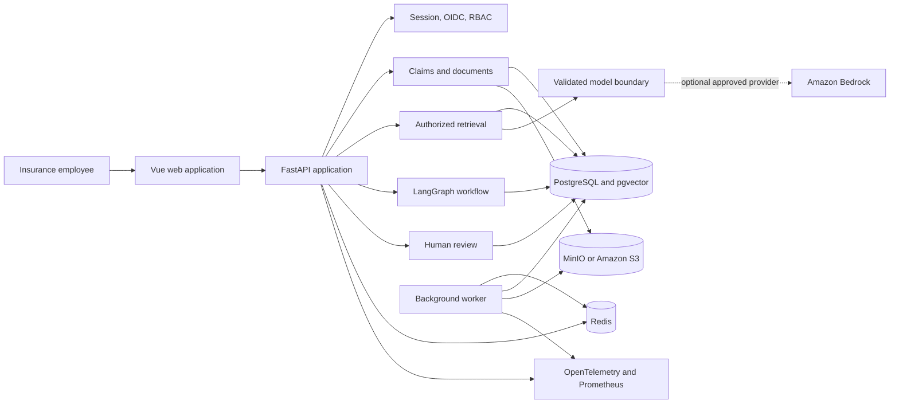

# AegisClaims AI - Governed Insurance Operations Platform

[](https://github.com/kushalsai09/aegisclaims-ai/actions/workflows/ci.yml)


AegisClaims AI is a production-oriented portfolio project for governed insurance claim operations. It helps employees organize claim records, retrieve evidence, generate citation-grounded briefs, and route ambiguous or risky work to authorized human reviewers.

The platform is deliberately designed as an internal decision-support system - not an autonomous claim decision-maker. It cannot approve or deny claims, issue payments, determine fraud, contact customers, or close claims.

All people, policies, claims, documents, organizations, and rules in this repository are **fictional synthetic demonstration data**.

## Why I Built This

Many AI portfolio projects stop at a chatbot or a single model call. I wanted to explore a harder and more realistic question:

> How can AI assist employees in a high-stakes workflow while keeping evidence traceable, permissions enforceable, and consequential decisions in human hands?

Insurance claims are a useful setting for that problem. A claim professional may need to review a notice of loss, contractor estimate, policy edition, extracted facts, conflicting evidence, and prior workflow history before taking action. A generic chatbot can summarize text, but it can also cite the wrong document, cross tenant boundaries, follow instructions hidden inside an uploaded file, or sound more authoritative than the evidence supports.

I built AegisClaims AI to demonstrate a safer pattern: authorization first, retrieval second, validation third, and human authority throughout.

## The Situation

Imagine an adjuster opening a residential property claim after a wind event. The claim contains:

- A notice of loss
- A contractor estimate
- Policy and product metadata
- Extracted dates, amounts, and reported damage
- Documents that may disagree or contain incomplete information
- A workflow that may require supervisor or compliance review

The adjuster needs to find supporting evidence quickly, but every answer must stay inside the authorized claim, point back to its source, use the applicable policy edition, and clearly communicate uncertainty.

## The Solution

AegisClaims provides one governed workspace where an employee can:

1. Sign in with a role-specific identity.
2. Open only claims permitted by tenant and assignment rules.
3. Upload and process source documents.
4. Search claim evidence using lexical and vector retrieval.
5. Ask questions and receive answers backed by inspectable citations.
6. Generate a structured Claim Evidence Brief.
7. Run an explicit LangGraph workflow with durable checkpoints.
8. Route missing, conflicting, ambiguous, or untrusted evidence to human review.
9. Inspect audit, operational, and evaluation information according to role.

## Product Principles

- **Evidence grounded:** generated content must resolve to authorized source material.
- **Human authorized:** automation organizes evidence but does not make consequential claim decisions.
- **Tenant isolated:** claim, document, retrieval, workflow, and review access is scope checked.
- **Auditable:** model use, workflow transitions, review decisions, and important security events are recorded.
- **Fail closed:** missing production security configuration prevents startup instead of weakening controls.
- **Honest about limitations:** deterministic local results are not presented as proof of live model quality.

## Key Features

### Claims operations experience

- Professional sign-in, dashboard, claim list, and claim workspace
- Claim metadata, policy context, document inventory, workflow status, and review history
- Role-aware navigation for adjusters, supervisors, compliance reviewers, and administrators
- Human Review, Operations, and Evaluation workspaces
- Responsive desktop and mobile layouts with accessible landmarks and controls

### Document ingestion and provenance

- PDF and text upload validation
- S3-compatible object storage through an application port
- Text extraction, OCR adapter boundary, classification, chunking, and fact extraction
- Checksums and page/chunk provenance
- Idempotent processing and duplicate-safe persistence
- Uploaded content treated as untrusted data rather than instructions

### Evidence retrieval

- Deterministic local vector embeddings
- Lexical and vector ranking
- Versioned reciprocal-rank fusion
- Policy-edition applicability checks
- Stable citation identifiers and source links
- Safe abstention for insufficient or conflicting evidence
- Claim, tenant, and assignment isolation before retrieval

### Controlled AI assistance

- Strict Pydantic request and response contracts
- Citation and evidence-fingerprint validation
- Unknown-field rejection
- Wrong-policy and unknown-citation rejection
- Prompt-injection and prohibited-language detection
- Model-provider abstraction with deterministic and Amazon Bedrock adapters
- No tools, database access, browser access, external communication, or decision authority granted to the model

### Human-in-the-loop workflows

- Explicit LangGraph stages
- Durable workflow checkpoints
- Idempotent restart and resume behavior
- Review routing for missing, conflicting, ambiguous, or untrusted evidence
- Stale-review rejection when claim evidence changes
- Human decision authority enforced outside the model

### Production readiness

- OIDC Authorization Code flow with PKCE, nonce, state, and one-time transactions
- Server-managed sessions and database-authoritative RBAC
- Redis-backed distributed rate limiting
- Content Security Policy, HSTS, trusted-host checks, and secure-cookie controls
- Dependency-aware readiness and process liveness endpoints
- Structured logs, Prometheus metrics, correlation IDs, OpenTelemetry, and Jaeger tracing
- Bounded pagination and bulk database loading
- Graceful worker shutdown and bounded retry behavior
- Hardened non-root containers with read-only filesystems and dropped capabilities

## Demo Roles

| Role | Example responsibility | Additional access |
|---|---|---|
| Claims adjuster | Review assigned claims and evidence | Claim workspaces and document upload |
| Supervisor | Oversee assigned work and reviews | Human review workflow |
| Compliance reviewer | Inspect governed activity | Review and evaluation visibility |
| Administrator | Operate the demonstration platform | Operations and Evaluation pages |

These roles demonstrate application behavior only. They do not represent a real insurer's organization or authority model.

## Demo Workflow

### 1. Sign in

Use one of the fictional development identities listed below. Production mode disables local passwords and requires OIDC.

### 2. Open the seeded property claim

The primary scenario is claim `HVC-SYN-2026-00017`, a fictional residential wind and exterior property damage claim.

### 3. Inspect its evidence

Review the notice of loss, contractor estimate, extracted facts, policy edition, and document-processing status.

### 4. Ask an evidence question

The search service retrieves only authorized claim chunks, fuses lexical and vector rankings, and returns source citations rather than an unsupported answer.

### 5. Review the evidence brief and workflow

The brief is parsed and validated against the authorized citation set. The workflow records each stage and explains whether human review is required.

### 6. Inspect authority boundaries

The UI explicitly shows that support assessment and autonomous claim decisions are not implemented. Evidence assistance cannot approve, deny, pay, contact, or close.

## Technology Stack

| Layer | Technology |
|---|---|
| Frontend | Vue 3, TypeScript, Vite, Vue Router, Vitest |
| API | Python, FastAPI, Pydantic, SQLAlchemy |
| Workflow | LangGraph with application-owned state and authorization |
| Data | PostgreSQL 17, pgvector, Alembic |
| Retrieval | Lexical ranking, deterministic embeddings, reciprocal-rank fusion |
| Queue and rate limits | Redis |
| Object storage | MinIO locally, S3 adapter for AWS |
| Model boundary | Deterministic provider locally, Amazon Bedrock adapter |
| Security | Argon2, OIDC, PKCE, server sessions, RBAC, CSP, HSTS |
| Observability | structlog, Prometheus, OpenTelemetry, Jaeger |
| Infrastructure | Docker Compose, Terraform, AWS ECS/Fargate |
| Quality | Pytest, Ruff, mypy, ESLint, Vitest, Locust, GitHub Actions |

## Architecture Overview



Detailed architecture, threat modeling, evaluation strategy, operational runbooks, and decisions are available in [`docs/`](docs/README.md).

## Repository Structure

```text
aegisclaims-ai/
  apps/                     # API, Vue web app, and worker containers
  packages/backend/src/     # Domain, application, delivery, and adapters
  migrations/               # Alembic schema history
  tests/                    # Backend and system tests
  data/synthetic/           # Fictional policies, claims, and documents
  data/golden/              # Deterministic evaluation expectations
  performance/              # Locust workload and thresholds
  infrastructure/           # Docker, observability, and Terraform
  scripts/                  # Smoke, evaluation, recovery, and backup checks
  docs/                     # Product, architecture, security, and operations
```

## Run Locally with Docker

### Prerequisites

- Git
- Docker Desktop with Docker Compose v2
- At least 6 GB of memory available to Docker

### Start the platform

```bash
git clone https://github.com/kushalsai09/aegisclaims-ai.git
cd aegisclaims-ai
cp .env.example .env
docker compose -f infrastructure/docker/compose.yaml up -d --build
./scripts/wait-for-stack.sh
```

The API container applies Alembic migrations and idempotently seeds the fictional portfolio before startup.

### Open the services

- Employee application: <http://localhost:5173>
- API documentation: <http://localhost:8000/docs>
- Jaeger traces: <http://localhost:16686>
- MinIO console: <http://localhost:9001>

Opening <http://localhost:8000/> directly may return `{"detail":"Not Found"}` because port 8000 is the API, not the web application.

### Development identities

All local accounts use the development-only password `HarborView!Local2026`.

| Email | Role |
|---|---|
| `avery.morgan@example.invalid` | Claims adjuster |
| `jordan.lee@example.invalid` | Supervisor |
| `riley.chen@example.invalid` | Compliance reviewer |
| `casey.patel@example.invalid` | Administrator |

Never reuse these fictional credentials outside local development.

### Stop the platform

```bash
docker compose -f infrastructure/docker/compose.yaml down
```

## Run Without Containers

Host mode is intentionally lighter and does not exercise PostgreSQL, MinIO, Redis, or the separate worker process.

```bash
python3 -m venv .venv
.venv/bin/python -m pip install --upgrade pip
.venv/bin/python -m pip install -e '.[dev]'
npm install
cp .env.host.example .env
mkdir -p .local
.venv/bin/alembic upgrade head
.venv/bin/python -m insurance_platform.seed
```

Start the API:

```bash
.venv/bin/uvicorn insurance_platform.delivery.api:create_app --factory --reload
```

Start the frontend in a second terminal:

```bash
npm run dev --workspace @insurance-ops/web
```

## Quality and Verification

The latest completed local verification produced:

- 91 passing backend tests and 2 intentionally skipped external integrations
- 16 passing frontend tests across 10 files
- 87.41% backend branch coverage
- Successful Python and TypeScript type checks
- Successful frontend production build
- Successful PostgreSQL migration downgrade and re-upgrade
- Successful Phase 1-7 Compose smoke tests
- Successful Redis, object-storage, PostgreSQL, API, and worker recovery exercise
- Successful PostgreSQL backup and isolated restore verification
- Locust smoke profile: 46 requests, 0 failures, 22 ms average, 33 ms p95, 86 ms p99

### Core quality commands

```bash
.venv/bin/ruff check .
.venv/bin/ruff format --check .
.venv/bin/mypy packages/backend/src
.venv/bin/pytest --cov=insurance_platform --cov-branch --cov-report=term --cov-fail-under=80

npm --prefix apps/web run lint
npm --prefix apps/web run typecheck
npm --prefix apps/web run test -- --run
npm --prefix apps/web run build
```

### End-to-end and evaluation checks

```bash
./scripts/smoke-test.sh
./scripts/auth-smoke-test.sh
./scripts/phase2-smoke-test.sh
./scripts/phase3-smoke-test.sh
./scripts/phase4-smoke-test.sh
./scripts/phase5-smoke-test.sh
./scripts/phase6-smoke-test.sh
./scripts/phase7-smoke-test.sh

./scripts/phase3-evaluate.sh
./scripts/phase4-evaluate.sh
./scripts/phase5-evaluate.sh
./scripts/phase6-evaluate.sh
./scripts/phase7-load-test.sh smoke
./scripts/phase7-resilience-test.sh
./scripts/phase7-backup-restore-test.sh
```

## Security and Governance Boundaries

The application intentionally prohibits model-driven:

- Claim approval or denial
- Coverage decisions
- Settlement or payment recommendations
- Fraud determinations
- Customer or third-party communication
- Claim closure
- Unrestricted tool, shell, database, filesystem, HTTP, or browser access

Production-like configuration rejects wildcard origins, HTTP identity endpoints, local passwords, SQLite, memory queues, deterministic model providers, static AWS storage credentials, and incomplete OIDC settings.

## Real Functionality vs Demonstration Boundaries

### Implemented and verified locally

- Vue/FastAPI application with server-side persistence
- PostgreSQL migrations and pgvector extension
- Redis work queue and distributed rate limiting
- MinIO document storage
- Document ingestion, extraction, classification, chunking, and provenance
- Hybrid evidence retrieval and inspectable citations
- LangGraph workflows and human-review routing
- Deterministic model provider with strict validation
- Bedrock adapter boundary
- Local authentication and production OIDC implementation
- RBAC, tenant isolation, sessions, security headers, metrics, tracing, and audit records
- Load, recovery, backup/restore, smoke, and regression checks

### Designed but not deployed or live-tested

- AWS ECS/Fargate deployment
- RDS Multi-AZ, ElastiCache, S3, Secrets Manager, CloudWatch, and private VPC endpoints
- Live enterprise OIDC provider
- Live Amazon Bedrock model invocation
- DNS, TLS certificate, and production secrets
- Multi-region disaster recovery

Terraform is formatted and statically validated, but it has not been planned or applied against an AWS account. Deterministic local evaluation is never presented as live Bedrock performance.

## AWS Production Architecture

The Terraform foundation in [`infrastructure/terraform/`](infrastructure/terraform/README.md) describes:

- Two-availability-zone VPC
- Public load-balancer subnets and private application/data subnets
- TLS Application Load Balancer
- Independent ECS/Fargate web, API, and worker services
- RDS PostgreSQL Multi-AZ with managed credentials and backups
- Encrypted multi-AZ ElastiCache
- Private, versioned, block-public S3 storage
- ECR repositories with image scanning
- Secrets Manager references and workload IAM roles
- VPC endpoints, CloudWatch logs and alarms, and CPU autoscaling

## Known Limitations

- Runtime vector ranking currently uses a portable SQL chunk index; pgvector-native similarity search remains a future adapter.
- Live Bedrock requires approved AWS credentials, region, model access, quota, and cost controls.
- Production OIDC requires an actual provider registration and pre-provisioned subject mappings.
- Local performance numbers are developer-machine smoke results, not production capacity claims.
- WAF, SQS/DLQ, transactional outbox, cross-region recovery, and zero-downtime schema orchestration are not implemented.
- All claim and policy content is synthetic and must not be interpreted as insurance guidance.

## Future Improvements

- Add a pgvector-native retrieval adapter and benchmark it against the portable index.
- Exercise the Bedrock adapter with approved model access and provider-specific evaluations.
- Configure a real OIDC provider in a non-production sandbox.
- Add browser-driven end-to-end tests to CI.
- Add WAF, durable outbox/DLQ processing, and cross-region recovery when justified by production requirements.
- Apply Terraform in a sandbox AWS account and conduct an actual infrastructure recovery exercise.

## What This Project Demonstrates

AegisClaims AI shows how I approach full-stack AI engineering beyond a prototype prompt. It combines product thinking, frontend implementation, backend architecture, retrieval quality, workflow control, security, testing, observability, cloud design, and operational recovery.

Most importantly, it demonstrates that responsible AI engineering is not only about generating an answer. It is about proving where the answer came from, deciding when the system should abstain, enforcing who may access the evidence, recording what happened, and preserving human authority where the consequences matter.
